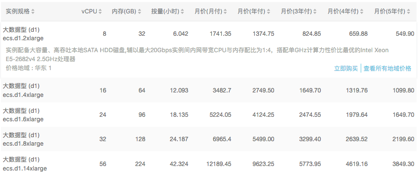

# 采购分析
第一阶段，数据准备
核心目标：采用最节省资源的办法，达到最快的数据采集的目标
已有资源：

特点：单核CPU，512内存，20GB普通系统盘
可以胜任：Python应用（任务管理服务）
注意：阿里云只对出网带宽收取费用，入网带宽免费，内网通讯免费。充分利用该特点，采用分布式本地计算方式，可以节约费用。

ECS服务器 https://help.aliyun.com/product/25365.html?spm=5176.7842090.6.1.IV9gTQ
计费标准：https://www.aliyun.com/price/product?spm=5176.doc25411.2.7.XK4nvt#/ecs/detail
大数据服务器：

GPU深度运算服务器：

特点：可以API管理弹性创建和释放资源，满足短暂的计算需求
可以胜任：数据分析

OSS对象云存储服务
使用场景： https://help.aliyun.com/document_detail/31819.html?spm=5176.doc52830.6.542.1JX4X1
OSS的使用限制如下： https://help.aliyun.com/document_detail/54464.html?spm=5176.doc31819.6.543.nARkiD
上传文件不能超过5GB，单个图片不能大于20MB，访问有1分钟的生效时间

计费规则：https://www.aliyun.com/price/product?spm=5176.doc25411.2.7.XK4nvt#/oss/detail

特点：可以远程Restful API访问，内网流量免费
可以胜任：资源库

Mongo: https://help.aliyun.com/document_detail/26561.html?spm=5176.doc26558.6.546.xx9EZb
云数据库MongoDB 分为三节点副本集版和集群版两套高可用配置。
三节点副本集版本价格由规格费用和磁盘空间费用组成。需要选择规格配置和磁盘空间搭配使用。
集群版本由mongos，shard和configserver三个组件组成。可以自行选择mongos和shard组件的个数和配置。mongos价格由规格费用组成，shard和configserver价格由规格费用和磁盘空间费用组成。

计费标准：https://www.aliyun.com/price/product?spm=5176.doc25411.2.7.XK4nvt#/mongodb/detail

上面的计价规则不明显，进入购买页：

特点：可按需开启，实时释放，备份和恢复，但热数据过程可能有点儿长。公网可以访问。
可以胜任：短时的计算需求

MYSQL https://help.aliyun.com/document_detail/48128.html?spm=5176.doc26322.6.542.hwmUoj
HybridDB for MySQL计费项包括：
数据库节点费用：用户选定规格的节点单价×节点数量×使用时长。
用户创建的数据库由多个节点（Node）组成，每个数据库节点包括一定数量的CPU、内存和硬盘资源。

计费规则：https://www.aliyun.com/price/product?spm=5176.doc25411.2.7.XK4nvt#/petadata/detail

特点：方便结合数仓分析，提供实时分析可能。不能自动释放实例。公网可以访问。
可以胜任：及时计算需求

大数据计算服务   https://www.aliyun.com/price/product?spm=5176.doc25411.2.7.XK4nvt#/maxcompute/detail
MaxCompute   以项目为基本的收费单位，从存储、计算和数据下载三个方面分别计费。
MaxCompute开放的计算任务类型有：SQL，UDF，MapReduce，Graph及机器学习作业
特点：SQL查询方便
可以胜任：大数据分析

可以节约计算资源的办法（需要实验内网穿透）
1) Tensorflow分布式计算：http://blog.csdn.net/sydpz1987/article/details/51340277
2) Kubernetes分布式部署：http://dockone.io/article/93